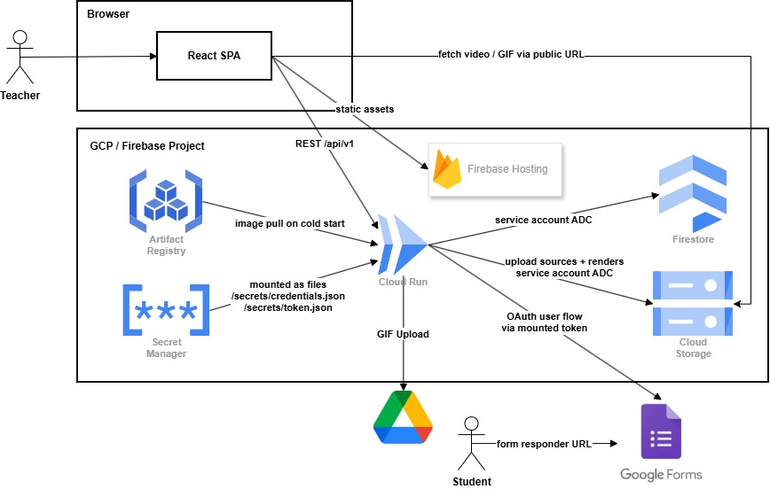

# Deployment Guide — PhysicsAnimator

PhysicsAnimator deploys in two pieces: the FastAPI backend runs as a container on **Google Cloud Run**, and the React frontend is served by **Firebase Hosting**. Firestore, Cloud Storage, and Secret Manager live in the same GCP/Firebase project as Cloud Run — there is no second project to manage. OAuth secrets for the Google Forms / Drive integration are kept in **Secret Manager** and mounted into Cloud Run as files; nothing sensitive is baked into the image.

---

## Table of Contents

1. [Architecture](#architecture)
2. [Prerequisites](#prerequisites)
3. [Step 1 — Enable required APIs](#step-1--enable-required-apis)
4. [Step 2 — Create the Artifact Registry repository](#step-2--create-the-artifact-registry-repository)
5. [Step 3 — Create the Cloud Run service account](#step-3--create-the-cloud-run-service-account)
6. [Step 4 — Create the OAuth files for Google Forms / Drive](#step-4--create-the-oauth-files-for-google-forms--drive)
7. [Step 5 — Build and push the Docker image](#step-5--build-and-push-the-docker-image)
8. [Step 6 — Create Secret Manager secrets](#step-6--create-secret-manager-secrets)
9. [Step 7 — Deploy the Cloud Run service](#step-7--deploy-the-cloud-run-service)
10. [Step 8 — Deploy the frontend to Firebase Hosting](#step-8--deploy-the-frontend-to-firebase-hosting)
11. [Post-deploy verification](#post-deploy-verification)
12. [Troubleshooting](#troubleshooting)

---

## Architecture



**Data flow.** The teacher loads the SPA from Firebase Hosting. The SPA calls Cloud Run at `VITE_API_BASE_URL` for the REST API, and fetches generated videos and GIFs **directly from Cloud Storage** via the public URLs the API returns — the media bytes never stream through Cloud Run. Cloud Run reads/writes Firestore and uploads media to Cloud Storage via the attached service account, and calls the Google Forms + Drive APIs using the user-OAuth token mounted from Secret Manager. Students receive the form responder URL and answer the question inside Google Forms.

---

## Prerequisites

| Tool | Purpose |
| --- | --- |
| Docker Desktop | Build the backend container image |
| `gcloud` CLI | Push images, manage secrets, optionally drive everything from the terminal |
| Node.js 18+ | Build the React frontend |
| Firebase CLI (`npm install -g firebase-tools`) | Deploy to Firebase Hosting |

You also need:

- A Google Cloud / Firebase project with **billing enabled** (Cloud Run requires it).
- Owner or Editor on that project.
- `gcloud auth login` completed and `gcloud config set project PROJECT_ID` pointed at the right project.

Throughout this guide, replace `PROJECT_ID` with your project ID and `REGION` with your chosen region (e.g., `asia-southeast2`).

---

## Step 1 — Enable required APIs

Enable the four APIs Cloud Run + Secret Manager actually need, plus the Forms/Drive APIs the OAuth integration calls.

**Console:** APIs & Services → Library → search and enable each of:

- Cloud Run Admin API
- Artifact Registry API
- Identity and Access Management (IAM) API
- Secret Manager API
- Google Forms API
- Google Drive API

**Equivalent CLI:**

```bash
gcloud services enable \
  run.googleapis.com \
  artifactregistry.googleapis.com \
  iam.googleapis.com \
  secretmanager.googleapis.com \
  forms.googleapis.com \
  drive.googleapis.com
```

The Forms + Drive APIs are required because [`form_tools.py`](server/src/tools/form_tools.py) creates and updates the workspace's Google Form and uploads the generated GIF to Drive.

---

## Step 2 — Create the Artifact Registry repository

This is where the backend image lives between `docker push` and Cloud Run pulling it.

**Console:** Artifact Registry → Repositories → **+ Create Repository**.

| Field | Value |
| --- | --- |
| Name | `physicsanimator` |
| Format | Docker |
| Mode | Standard |
| Location type | Region |
| Region | e.g., `asia-southeast2` |
| Encryption | Google-managed |

**Equivalent CLI:**

```bash
gcloud artifacts repositories create physicsanimator \
  --repository-format=docker \
  --location=REGION \
  --description="PhysicsAnimator backend images"
```

**Save the repository path** — you will paste it into every `docker build` / `docker push` command:

```
REGION-docker.pkg.dev/PROJECT_ID/physicsanimator
```

The full image reference adds the image name and tag, e.g. `REGION-docker.pkg.dev/PROJECT_ID/physicsanimator/backend:latest`.

---

## Step 3 — Create the Cloud Run service account

Cloud Run runs as a service account; that identity is what talks to Firestore, GCS, and Secret Manager.

**Console:** IAM & Admin → Service Accounts → **+ Create Service Account**.

| Field | Value |
| --- | --- |
| Service account name | `physicsanimator-run` |
| Service account ID | `physicsanimator-run` (auto-filled) |
| Description | Cloud Run backend identity |

On the **Grant access** step, add all three roles:

- **Cloud Datastore User** — Firestore read/write.
- **Firebase Admin** — Firebase / Firebase Storage administration.
- **Storage Admin** — full Cloud Storage bucket administration.

**Save the resulting service-account email** — you will reuse it in Step 6 (Secret Manager access) and Step 7 (Cloud Run identity):

```
physicsanimator-run@PROJECT_ID.iam.gserviceaccount.com
```

### Generate a JSON key for local development

For running the backend locally (and for one-off scripts like the OAuth flow in Step 4), generate a JSON key:

1. Open the service account → **Keys** tab → **Add Key** → **Create new key** → choose **JSON** → Create.
2. The browser downloads a JSON file. Move it into `server/` (e.g., `server/service-account.json`).
3. In `server/.env`, set:
   ```env
   GOOGLE_APPLICATION_CREDENTIALS=server/service-account.json
   ```

> On Cloud Run you do **not** set `GOOGLE_APPLICATION_CREDENTIALS`. The attached service account provides Application Default Credentials automatically. The JSON key is only for local development.

The `server/.gitignore` already excludes JSON keys — never commit this file.

---

## Step 4 — Create the OAuth files for Google Forms / Drive

The backend acts on behalf of a real Google account when it creates Google Forms and uploads GIFs to Drive. That requires two files: `credentials.json` (which app is asking) and `token.json` (which user has granted access).

### What `credentials.json` is

This is the OAuth 2.0 Client ID descriptor for a **Desktop app**. It identifies *the application* to Google's OAuth server and contains a `client_id` + `client_secret`. It does not grant access to any user data on its own.

**To create it:**

1. **Console:** APIs & Services → **Credentials** → **+ Create Credentials** → **OAuth client ID**.
2. If prompted, configure the OAuth consent screen first (External user type, fill in app name + support email, add the test user account you will sign in with).
3. Application type: **Desktop app**. Give it a name (e.g., `physicsanimator-forms`).
4. Click **Download JSON** on the resulting client.
5. Save it as `server/credentials.json`.

### What `token.json` is

This is the per-user OAuth grant produced **after** a Google user signs in and approves the Forms + Drive scopes. It is generated locally by [`_get_creds()` in `server/src/tools/form_tools.py`](server/src/tools/form_tools.py), which calls `InstalledAppFlow.run_local_server(port=0)`. The flow opens a browser, the user consents, and `token.json` is written to disk containing an `access_token` plus a long-lived `refresh_token`.

This step must run on a workstation with a browser — Cloud Run cannot complete the consent flow.

**To mint `token.json` locally (one-time):**

```bash
cd server
python -c "from src.tools.form_tools import _get_creds; _get_creds()"
```

Sign in with the Google account that owns the target Forms and Drive workspace and approve the requested scopes. `token.json` is written next to `credentials.json`.

> Security: the `refresh_token` inside `token.json` grants ongoing Forms + Drive access to the signed-in account. Treat the file like a password — `.gitignore` already excludes it.

Both files now exist under `server/`. They are uploaded to Secret Manager in Step 6 and mounted into Cloud Run in Step 7. They are *not* baked into the image.

---

## Step 5 — Build and push the Docker image

**Authenticate Docker with Artifact Registry** (one-time per machine):

```bash
gcloud auth configure-docker REGION-docker.pkg.dev
```

**Build the image:**

```bash
cd server
docker build -t REGION-docker.pkg.dev/PROJECT_ID/physicsanimator/backend:latest .
```

**Push the image:**

```bash
docker push REGION-docker.pkg.dev/PROJECT_ID/physicsanimator/backend:latest
```

Verify in the console: **Artifact Registry → Repositories → physicsanimator → backend** should now list a `latest` tag with the build timestamp.

---

## Step 6 — Create Secret Manager secrets

Both OAuth files live in Secret Manager and are mounted into the container as files. The Dockerfile entrypoint expects them at fixed paths (see [server/Dockerfile:59](server/Dockerfile#L59)), so use those exact mount paths in Step 7.

**Console:** Security → Secret Manager → **+ Create Secret**.

Create two secrets:

| Secret name | Upload | Used for |
| --- | --- | --- |
| `credentials-json` | `server/credentials.json` | OAuth client descriptor |
| `token-json` | `server/token.json` | User OAuth grant (access + refresh tokens) |

**Equivalent CLI:**

```bash
gcloud secrets create credentials-json --data-file=server/credentials.json
gcloud secrets create token-json --data-file=server/token.json
```

**Grant the Cloud Run service account access to both secrets.** Open each secret in the console → **Permissions** → **Grant Access**, then:

- New principals: `physicsanimator-run@PROJECT_ID.iam.gserviceaccount.com`
- Role: **Secret Manager Secret Accessor**

**Equivalent CLI** (run for each secret):

```bash
gcloud secrets add-iam-policy-binding credentials-json \
  --member="serviceAccount:physicsanimator-run@PROJECT_ID.iam.gserviceaccount.com" \
  --role="roles/secretmanager.secretAccessor"

gcloud secrets add-iam-policy-binding token-json \
  --member="serviceAccount:physicsanimator-run@PROJECT_ID.iam.gserviceaccount.com" \
  --role="roles/secretmanager.secretAccessor"
```

### Dockerfile contract for mount paths

On container start, the entrypoint at [server/Dockerfile:59](server/Dockerfile#L59) seeds a writable token by copying `$GOOGLE_TOKEN_SEED_PATH` (default `/secrets/token.json`) to `$GOOGLE_TOKEN_PATH` (default `/tmp/token.json`). The OAuth client uses the writable copy so token refresh works. To match these defaults, mount the secrets at:

- `credentials-json` → `/secrets/credentials.json`
- `token-json` → `/secrets/token.json`

You configure these mounts in the next step.

---

## Step 7 — Deploy the Cloud Run service

**Console:** Cloud Run → **+ Create Service**.

Under **Container image URL**, click **Select** and pick:

```
REGION-docker.pkg.dev/PROJECT_ID/physicsanimator/backend:latest
```

### Service settings

| Field | Value |
| --- | --- |
| Service name | `physicsanimator-backend` |
| Region | Same region as Artifact Registry |
| Authentication | Allow unauthenticated invocations |
| CPU allocation | CPU is only allocated during request processing |
| Minimum instances | `0` |
| Maximum instances | `3` |

Expand **Container, Networking, Security** to configure the rest.

### Container tab

| Field | Value |
| --- | --- |
| Container port | `8080` |
| Memory | `2 GiB` |
| CPU | `2` |
| Request timeout | `3600` |
| Concurrency | `1` |

Manim rendering can hold ~1.5 GiB peak; the 2 GiB / 2 CPU sizing gives headroom. Concurrency = 1 ensures each instance handles one pipeline at a time so a long render does not block other requests.

### Variables & Secrets — Environment variables

Add each of these as a plain environment variable:

| Name | Value |
| --- | --- |
| `GOOGLE_API_KEY` | Gemini API key |
| `GOOGLE_CLOUD_PROJECT` | Your project ID |
| `GCS_BUCKET_NAME` | GCS bucket name (e.g., `physicsanimator-assets`) |
| `FIREBASE_STORAGE_BUCKET` | Firebase storage bucket — usually the same value as `GCS_BUCKET_NAME` |
| `FIRESTORE_DATABASE_ID` | `physicsanimator-hackathon` (or your Firestore DB ID) |
| `PIPELINE_MODE` | `legacy_generation` |
| `PIPELINE_MAX_RETRIES` | `1` |
| `PIPELINE_TIMEOUT_SECONDS` | `1200` |
| `GOOGLE_CREDENTIALS_PATH` | `/secrets/credentials.json` |
| `GOOGLE_TOKEN_SEED_PATH` | `/secrets/token.json` |
| `GOOGLE_TOKEN_PATH` | `/tmp/token.json` |
| `CORS_ALLOWED_ORIGINS` | `https://YOUR_PROJECT_ID.web.app` (set after Step 8 if not known yet) |

> Do **not** set `GOOGLE_APPLICATION_CREDENTIALS` on Cloud Run. The attached service account provides ADC.

### Variables & Secrets — Volumes (mount secrets as files)

Click **+ Add volume** → **Reference a secret**, then mount each secret as a file. Do this twice:

| Volume | Secret | Version | Mount path |
| --- | --- | --- | --- |
| `credentials-volume` | `credentials-json` | `latest` | `/secrets/credentials.json` |
| `token-volume` | `token-json` | `latest` | `/secrets/token.json` |

The mount paths must match the values you set in `GOOGLE_CREDENTIALS_PATH` and `GOOGLE_TOKEN_SEED_PATH` above.

### Security tab — attach the service account

In the **Service account** dropdown, select:

```
physicsanimator-run@PROJECT_ID.iam.gserviceaccount.com
```

Click **Create**. Cloud Run pulls the image, mounts the secrets, and starts the container (1–3 minutes).

Once the service is live, copy the URL at the top of the page:

```
https://physicsanimator-backend-XXXXXXXX-uc.a.run.app
```

You will paste this URL into the frontend's `.env.production` in Step 8.

---

## Step 8 — Deploy the frontend to Firebase Hosting

### Create the Firebase project (if needed)

1. Go to [console.firebase.google.com](https://console.firebase.google.com).
2. Click **Add project**, or pick the same GCP project from Step 1 and add Firebase to it (recommended — one project for everything).
3. In the Firebase console: **Build → Hosting → Get started** and click through the wizard. Firebase provisions a default site at `YOUR_PROJECT_ID.web.app`.

### Point the frontend at the Cloud Run URL

Create or edit `client/.env.production`:

```env
VITE_API_BASE_URL=https://physicsanimator-backend-XXXXXXXX-uc.a.run.app
```

No trailing slash.

### Build

```bash
cd client
npm install
npm run build
```

This emits the static site to `client/dist/`.

### Initialise Firebase (one-time per machine)

```bash
firebase login
firebase init hosting
```

Answer the prompts:

| Prompt | Answer |
| --- | --- |
| Which Firebase project? | Pick the project from above |
| Public directory | `dist` |
| Configure as a single-page app? | **Yes** |
| Set up automatic builds and deploys with GitHub? | **No** |
| Overwrite `dist/index.html`? | **No** |

This creates `client/firebase.json` and `client/.firebaserc`. Commit both.

### Deploy

```bash
firebase deploy --only hosting
```

The CLI prints:

```
Hosting URL: https://YOUR_PROJECT_ID.web.app
```

If you have not already, go back to Cloud Run and set `CORS_ALLOWED_ORIGINS` to this hosting URL, then deploy a new Cloud Run revision so the change takes effect.

---