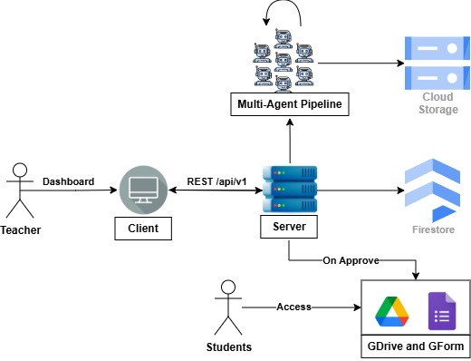
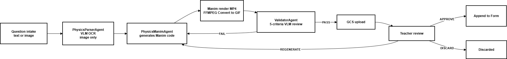
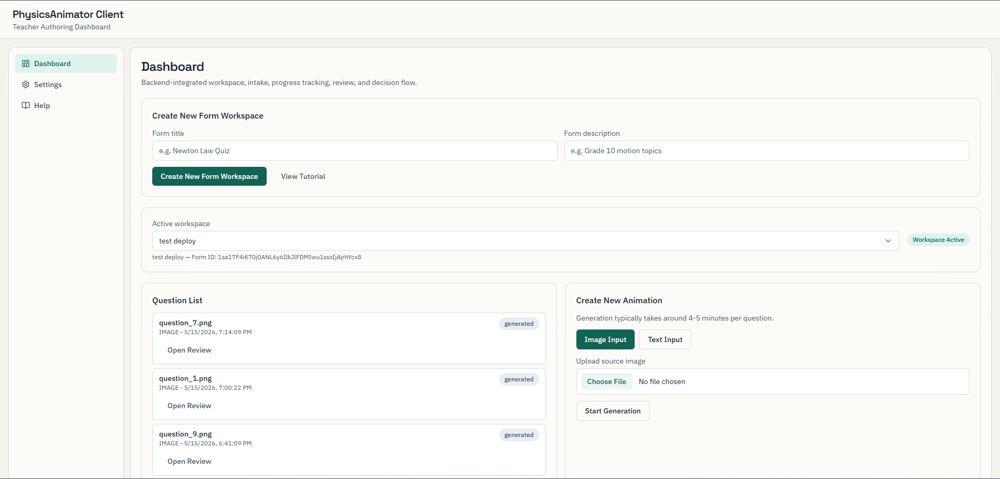
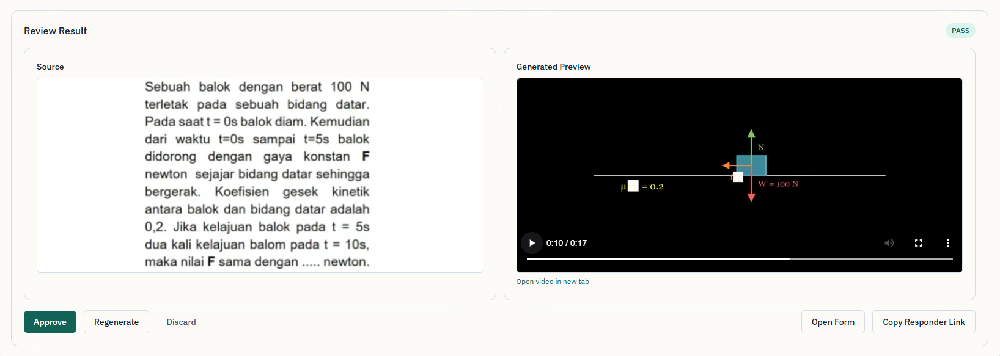

# PhysicsAnimator

> Turning physics questions into observable animations — built for the Gemma Hackathon 2026.

PhysicsAnimator is a teacher-facing tool that converts text or image-based physics questions into short Manim animations. Teachers create a workspace (backed by a Google Form), upload questions, review the generated animations, and approve the good ones — approved questions are appended automatically to the workspace's Google Form so students answer them by observing the animation rather than by reading raw text or image input.

---

## The Problem

In the LLM era, most physics problems set as plain text or as a question-paper image have effectively become open-book. A student can paste the image or the text into any chat model and receive a worked solution in seconds. The model does the *observing* and the *modelling* for them, which are precisely the skills physics education is supposed to develop.

The cost is hidden but compounding: students stop practising the foundational habit of looking at a situation, picking out the relevant objects and variables, and translating them into a model. By the time they reach problems that need it, the skill is not there.

## Our Solution

PhysicsAnimator reframes each question as a short video animation of the physical scenario:

- The student watches the animation and has to identify the geometry, the given values, the forces, and what the question is actually asking.
- This mirrors how real physics works — observe the phenomenon first, then build the model.
- A multi-agent validator (Gemini VLM) enforces an **anti-cheat constraint**: the final numerical answer must never appear in the animation. Students see the setup, not the solution.
- The pipeline focuses on physics first, but the same approach generalises to any subject where observation matters more than the wording of a prompt.

---

## Architecture



## Generation Pipeline



---

## Screenshots / Demo

**Dashboard**



**Review panel**



**Generated animation example**


---

## Tech Stack

- **Frontend:** React 19, React Router 7, TypeScript 6, Vite 8, Tailwind CSS 3, Radix UI, Lucide icons.
- **Backend:** Python 3.11+, FastAPI, Pydantic v2, Uvicorn.
- **AI / Generation:** Google Gemini 2.0 Flash (via `google-genai`), Google ADK (Agent Development Kit), Manim CE 0.19.
- **Cloud / Storage:** Firestore, Google Cloud Storage, Google Forms API, Google Drive API, Cloud Run.
- **Tooling:** Docker, Firebase Hosting, ffmpeg.

---

## How to Run (local)

### Prerequisites

- Node.js 18+ and npm
- Python 3.11+
- `ffmpeg` on the system PATH (required for MP4 → GIF conversion)
- A Google Cloud project with Firestore, Cloud Storage, and the Gemini API enabled
- OAuth credentials (`credentials.json` + `token.json`) for the Google Forms / Drive APIs, placed under `server/env/`

### Backend

```bash
cd server
python -m venv .venv
.venv\Scripts\activate              # Windows PowerShell: .venv\Scripts\Activate.ps1
pip install -r requirements.txt
copy .env.example .env              # then fill in the values listed below
python -m uvicorn app.main:app --host 0.0.0.0 --port 8001 --reload --reload-dir app --reload-dir src
```

The interactive API explorer is at `http://localhost:8001/docs`.

### Frontend

```bash
cd client
npm install
copy .env.example .env              # set VITE_API_BASE_URL=http://localhost:8001
npm run dev
```

Open `http://localhost:5173`.

> The shipped `client/.env.example` defaults to port `8000`. If you run the backend on `8001` (as above), make sure your `.env` reflects that.

For deeper setup notes see [client/README.md](client/README.md) and [server/README.md](server/README.md).

---

## Environment Variables

| Variable | Scope | Required | Description |
| --- | --- | --- | --- |
| `VITE_API_BASE_URL` | client | yes | Base URL of the FastAPI backend (e.g. `http://localhost:8001`). |
| `GOOGLE_API_KEY` | server | yes | Gemini API key used by the agents. |
| `GOOGLE_CLOUD_PROJECT` | server | yes | GCP project ID hosting Firestore and Cloud Storage. |
| `GOOGLE_APPLICATION_CREDENTIALS` | server | yes | Path to the service account JSON used for Firestore + GCS. |
| `GCS_BUCKET_NAME` | server | yes | Cloud Storage bucket for uploaded sources and rendered media. |
| `FIREBASE_STORAGE_BUCKET` | server | yes | Firebase storage bucket (typically the same value as `GCS_BUCKET_NAME`). |
| `FIRESTORE_DATABASE_ID` | server | no | Firestore database ID. Defaults to `physicsanimator-hackathon`. |
| `PIPELINE_MODE` | server | no | `legacy_generation` (default), `legacy_full_fallback`, or `mock`. |
| `PIPELINE_MAX_RETRIES` | server | no | Max retries inside the pipeline. Defaults to `1`. |
| `PIPELINE_TIMEOUT_SECONDS` | server | no | Per-job timeout. Defaults to `1200`. |
| `CORS_ALLOWED_ORIGINS` | server | no | Comma-separated origins. Defaults to `http://localhost:5173,http://localhost:8001`. |
| `API_PREFIX` | server | no | API path prefix. Defaults to `/api/v1`. |
| `GOOGLE_CSE_API_KEY` | server | no | Used by reference-image search tooling. |
| `GOOGLE_CSE_CX` | server | no | Custom Search Engine ID used alongside `GOOGLE_CSE_API_KEY`. |

---

## Deployment

The backend ships as a multi-stage Docker image and runs on Google Cloud Run; the client builds to a static bundle and is hosted on Firebase Hosting. See [DEPLOYMENT.md](DEPLOYMENT.md) for the full step-by-step (Artifact Registry, Secret Manager, Cloud Run, Firebase) and [ARCHITECTURE_DISCUSSION.md](ARCHITECTURE_DISCUSSION.md) for the Cloud Run trade-offs.

---

## Documentation

- [client/README.md](client/README.md) — frontend overview, directory tree, and page reference.
- [server/README.md](server/README.md) — backend overview, directory tree, multi-agent pipeline, and API reference.
- [DEPLOYMENT.md](DEPLOYMENT.md) — deployment guide.
- [ARCHITECTURE_DISCUSSION.md](ARCHITECTURE_DISCUSSION.md) — Cloud Run architecture analysis.

---

## License

Released under the MIT License. Built for the Gemma Hackathon 2026.
